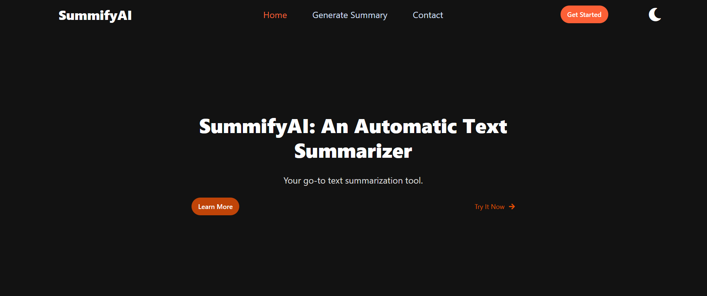
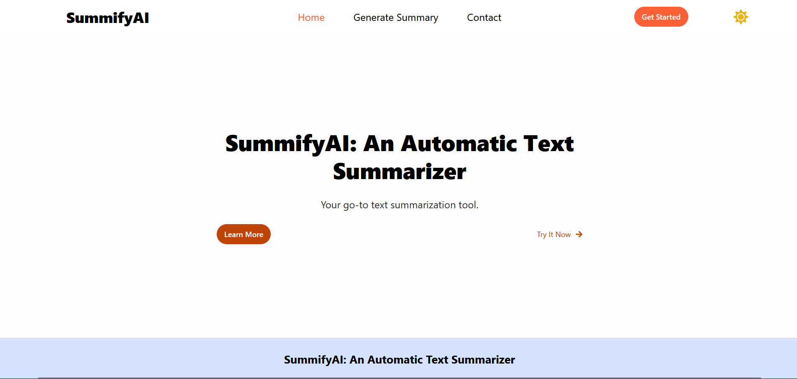
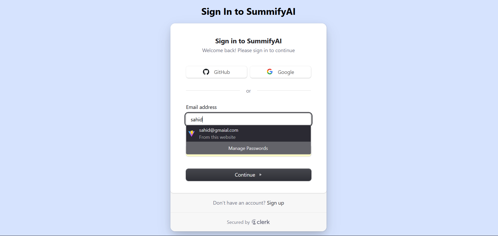
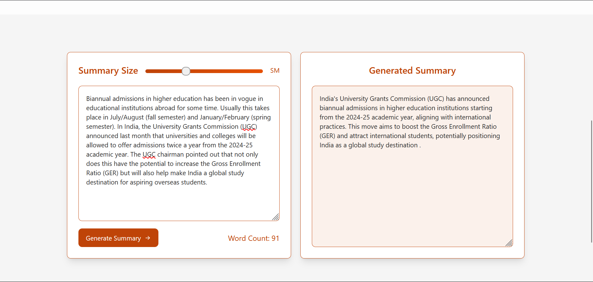
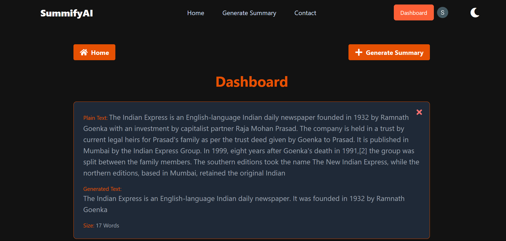

# SummifyAI - An Automatic Text Summarizer

SummifyAI is an advanced text summarization project that utilizes the cutting-edge Pegasus model to generate precise and coherent summaries for various types of text, including general content and chat conversations. The project includes model training, API development, and a web application for user interaction.

## Table of Contents
- [Overview](#overview)
- [Features](#features)
- [Tech Stack](#tech-stack)
- [Demo](#demo)
- [Screenshots](#screenshots)
- [Installation](#installation)
- [Usage](#usage)
- [Project Structure](#project-structure)
- [Contributing](#contributing)
- [License](#license)

## Demo
To explore the SummifyAI application, use the following demo credentials:
```sh
- **Email**: **`demo@example.com`**
- **Password**: **`demoPassword123`**
```

### Live Website
Access the live SummifyAI application here: [SummifyAI Live](https://your-website-url.com)

### Demo Video
Watch the demo video of the SummifyAI application here: [Watch the demo video](https://youtu.be/_7cHaofl5uA)

[](https://youtu.be/_7cHaofl5uA)

## Overview
The SummifyAI project aims to efficiently summarize various types of text, including chat conversations and general content. It employs the Pegasus text summarization model, fine-tuned on the Samsum dataset to achieve a ROUGE-1 score of 23%. The project features a FastAPI backend for API services and a Vite-powered React frontend for user interaction.

## Features
- **State-of-the-Art Summarization**: Leverages the Pegasus model for high-quality text summarization.
- **General and Chat Summarization**: Summarizes both general text content and chat conversations.
- **API Services**: Utilizes FastAPI for handling summarization requests.
- **Responsive Web Application**: Built with Vite React for a modern UI and smooth user experience.
- **State Management**: Uses Context API for efficient state management.
- **HTTP Request Handling**: Manages requests using Axios.
- **UI Components**: Includes Shadcn/ui for pre-built UI components.
- **Database Integration**: Employs MongoDB for data storage.
- **User Authentication**: Integrated with Clerk for frontend authentication.

## Tech Stack
- **Backend**: Python, FastAPI, Node.js
- **Frontend**: Vite React, Context API, Axios, Shadcn/ui
- **Model**: Pegasus Text Summarizer
- **Database**: MongoDB
- **Authentication**: Clerk
- **Development Tools**: Jupyter Notebook, Postman

## Screenshots

Here are some screenshots of the SummifyAI application:

### Homepage


### Sign In


### Summary Page


### Dashboard


## Installation

### Prerequisites
- Python 3.8 or higher
- Node.js 14 or higher
- MongoDB
- npm (Node Package Manager)

### Setup

Follow these steps to set up the project for development:

1. **Clone the Repository**
   Clone the repository to your local machine:
   ```sh
   git clone https://github.com/your-username/SummifyAI-an-Automatic-text-summarizer.git
   cd SummifyAI-an-Automatic-text-summarizer
   ```

2. **Frontend Setup**
   Navigate to the `Frontend` directory and set up the environment variables:
   - Create a `.env` file with the following variables:
     ```
     VITE_MODEL_URL=<URL of the backend API>
     VITE_CLERK_PUBLISHABLE_KEY=<Your Clerk Publishable Key>
     ```
   - Install dependencies and start the development server:
     ```sh
     cd Frontend
     npm install
     npm run dev
     ```

3. **Backend Setup**
   Navigate to the `Backend` directory and set up the environment variables:
   - Create a `.env` file with the following variables:
     ```
     MONGODB_URI=<Your MongoDB URI>
     PORT=<Port number for the backend server>
     MODEL_API_URL=<URL of the model API>
     ```
   - Install dependencies and start the backend server:
     ```sh
     cd Backend
     npm install
     node src/index.js
     ```

4. **Model Setup**
   Set up the model environment and start the model server:
   - Create a virtual environment and activate it:
     ```sh
     python -m venv venv
     source venv/bin/activate   # On Windows: venv\Scripts\activate
     ```
   - Install the model dependencies:
     ```sh
     pip install -r requirements.txt
     ```
   - Run the model server:
     ```sh
     python app.py
     ```

## Usage
1. Ensure both the backend and frontend servers are running.
2. Open your browser and navigate to `http://localhost:3000` to access the SummifyAI web application.
3. Authenticate using Clerk and start summarizing your text data.

## Project Structure
```
SummifyAI-an-Automatic-text-summarizer/
│
├── Backend/
│   ├── src/
│   │   ├── controller/      # Business logic for handling requests
│   │   ├── db/              # Database configuration and connection
│   │   ├── models/          # Database models
│   │   ├── router/          # API routes
│   │   ├── app.js           # Application setup and middleware
│   │   └── index.js         # Entry point for the backend server
│   └── .env                 # Environment variables for the backend
│
├── Frontend/
│   ├── src/
│   │   ├── components/     # React components
│   │   ├── Context/        # Context API setup
│   │   ├── Services/       # API services and requests
│   │   ├── pages/          # Application pages
│   │   ├── App.jsx         # Main application file
│   │   └── index.js        # Entry point
│   ├── public/             # Public assets
│   ├── .env                 # Environment variables for the frontend
│   ├── package.json        # Frontend dependencies
│   └── ...
│
├── Model/
│   ├── src/
│   │   ├── textSummarizer/
│   │   │   ├── config/      # Configuration files
│   │   │   ├── constant/    # Constants and enums
│   │   │   ├── entity/      # Data entities and schemas
│   │   │   ├── logging/     # Logging setup
│   │   │   ├── pipeline/    # Data processing pipeline
│   │   │   └── utils/       # Utility functions
│   ├── app.py               # API for the model
│   ├── main.py              # Model training script
│   └── research/           # Jupyter notebooks for model testing
│
└── README.md               # Project documentation
```

## Contributing
Contributions are welcome! Please fork this repository and submit a pull request with your changes.

## License
This project is licensed under the MIT License. See the [LICENSE](LICENSE) file for details.
